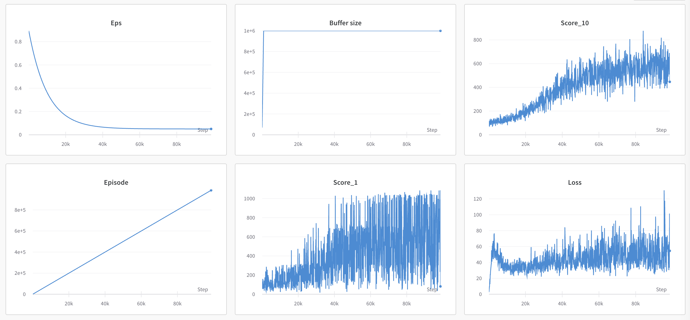
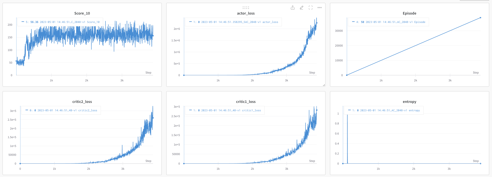

# RL for 2048
This repository includes Pytorch implementations of various RL algorithms with custom gym of 2048 game.

---

## Algorithms supported

- [x] DQN
- [x] SAC
- [ ] PPO

PPO algorithm will be supported soon.

DQN performs better than SAC. In my opinion, it is because 2048 game has small, discrete action space.
If you have any opinion/tips to improve SAC agent or if you have any other algorithms to be supported, feel free to contact me.(Issue or email)


---
## Set up

Install dependencies with Docker. You can also install dependencies using requirements.txt.

To build Docker image, run this command.
```
# format: docker build -t . <image_name>
docker build -t . 2048
```

After building image, use the following command to run the Docker container.
```
docker run -ti --gpus '"device='<gpu number>'"' -v <your working directory>:/app --ipc=host --name <container_name> <image_name> /bin/bash

# or you can run this command after changing docker_run.sh file in proper format
./docker_run.sh <gpu num> <container_name>
```
---
## Train
If you want to train your own agent, run
```
# For example, (in case of DQN agent)
python train_.py --config configs/config_dqn.yaml
```

You can freely change the hyperparameter if you needed.

---
## Test

You can test with the pretrained networks.
All pretrained networks can be downloaded in following [link](https://drive.google.com/drive/folders/1KJupRZ0yWHufZ4-E0Ns3QRr-CR4n7CNu?usp=share_link).


To render the playing result with the network, run
```
# before run this command, you should put the path to checkpoint in config file.
# For example, (in case of DQN agnet)
python render.py --config configs/config_dqn.yaml

```

---
## Results
My average score in 2048 game is  4000~5000.(I'm not good at this game) 

The rendered result of playing 2048 with DQN agent with seed 1234.(Score: 12392)


Training Logs of DQN agent. The average score is about 6000.


Traning Logs of SAC agent. The average score is about 2000.



---
## Acknowledgement
1. https://github.com/rajitbanerjee/2048-pygame
2. https://github.com/activatedgeek/gym-2048/tree/master/gym_2048
3. https://github.com/seungeunrho/minimalRL/